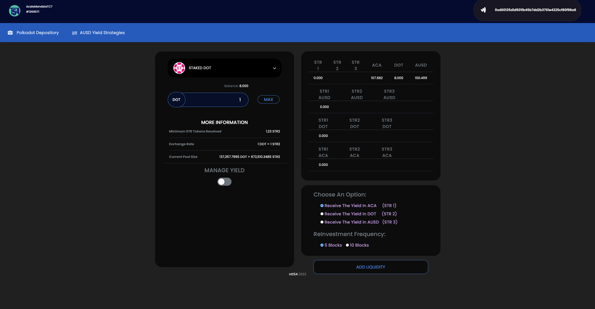
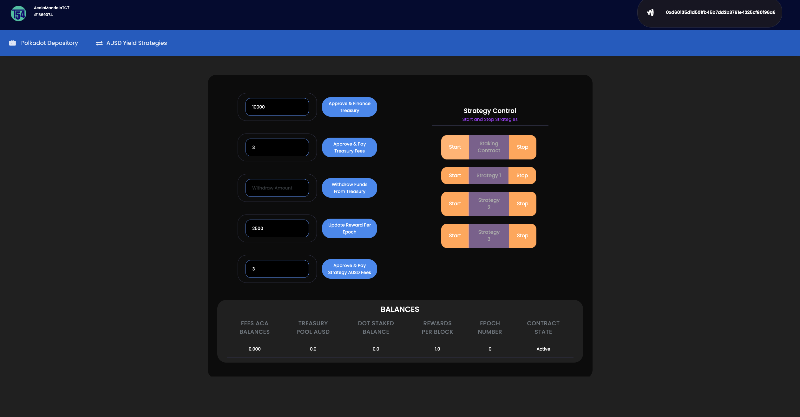

# Yield Manager



<br>


## Please use at your own risk. This a submission for bounty, not production/battle-tested and audited software.

<br>

# __Yield Manager AmsterDOT - Acala Bounties EVM+ Dapp for aUSD yield__


## Table of Contents
1. [General Info](#general-info)
2. [Website](#website)
3. [Demo Video](#demo-video)
4. [Installation](#installation)
5. [Using The Application ](#using-the-application)
6. [Smart Contracts Deployment](#smart-contracts-deployment)


<br>

## General Info
***
<p>This repo contains a DApp developped in AcalaMandalaTC7 that allows the user to deposit his DOT in a smart contract strategy which in turn stakes it for receiving AUSD yield. Upon collection of AUSD yield and dependent on the type of the strategy the user has chosen to deposit his DOT to, the AUSD proceeds are used to dollar cost average buy another asset e.g. ACA
</p>
<p>
For this bounty we showcase the strategy that AUSD proceeds are used to dollar cost average ACA
</p>

## Problems & Solutions
<p>
Our team always tries to use existing building blocks (defi legos) to develop useful software on top of these. However when needed we are ready to develop such "legos" ourselves
</p>
<p>
Our original plans where to use as a cashflow generator in Acala Mandala TC7 staking DOT for LDOT and/or add liquidity to AMM pools (e.g. ACA/DOT)
Then our strategy smart contracts would collect the yield produced in a periodic basis and either send it as AUSD income to the user or swap it for another token hence offering prescheduled periodic dollar cost averaging e.g. ACA, DOT, LDOT, BTC. Further more in case of staking DOT for LDOT we could offer utilising the excess yield in accumulating LDOT and borrowing safely AUSD to be send to the user as income.
</p>
<p>
Unfortunately we realised that in Acala Mandala TC7 testnet, it was not possible to stake DOT for LDOT  or claimRewards from liquidity added to any AMM pool. EVM+ has only recently being released and with various innovative protocols released (e.g. honzon, homa, multiple AMM listings, bridges, XCM channels etc.) it is understandable that these features will be offered very soon in the AcalaMandalaTC7 testnet.
</p>
<p>
Based on the prevailing conditions we considered that the best we could offer for this hackathon bounty, was besides our yield management strategies to create a staking contract that upon staking DOT it pays AUSD
</p>


<br>

### Website
***
<p>
We have deployed a website 
<a href="https://yieldmanager.vercel.app" target="_blank">here</a>
to showcase our application and hackathon bounty submission.
</p>
<p>
Please make sure you have the Metamask wallet Chrome extension installed and connected to Acala Mandala TC7 testnet parachain.
</p>
<p>
The website is best viewed on screen resolutions above 2560x1440px. 
Any future versions will accomodate responsive frameworks + mobile.
</p>
<br>

### Demo Video
***
<p> A demo video can be found 
<a href="https://www.dropbox.com/s/aqhthho72iugi37/Acala%20Cross-Parachain%20DApp%20Demo.mp4?dl=0" target="_blank">here</a>
to demonstrate the functionality of the yield management strategy and the staking contract. Please check it out!
</p>
<br>

### Installation
***
Create a new folder and inside it
```bash
$ git clone https://github.com/Entity54/AmsterDotAcalaYieldManager
$ cd FrontEnd
$ npm install
$ npm start
```

<br>

### Using The Application 
***
<p>
Welcome to Yield Manager. 
</p>

<p>
To begin with, you must ensure you connect and approve the Metamask extension pop up when interacting with this website. 
Please also ensure that Metamask is connected to the AcalaMandalaTC7 chain. 
</p>
<p>
This Dapp has two pages. The landing page AUSD Yield Strategies is the user facing page. The Polkadot Depository is an administrator's page to manage the smart contract that acts as the AUSD cahsflow generator. You must be logged in MetaMask Acala Mandala TC7 with the same account used as the admin account that deployed all the smart contracts
</p>


<br>

### __Polkadot Depository__
***

<p>

The administrator of the Staking smart contract ntt54StakeDOT.sol can click:

__Buttons__
* Approve & Finance Treasury to finance the staking smart contract with the number of AUSD desired
* Approve & Finance Treasury Fees to transfer enough ACA (suggested 3 ACA) to pay for the scheduler management of the staking smart contract
* Withdraw AUSD funds from the treasury (Affecting the depositors collected yield)
* Update Reward in AUSD per Epoch. This smart contract uses the Acala Scheduler to pay the Reward AUSD no more frequently than 5 blocks by default
* Approve & Pay ACA fees to the yield management smart contract so it can pay the Acala Scheduler invoked transactions fees
</p>

<p>

__Strategy Control__
* Click Start to kick start the staking smart contract ntt54StakeDOT or stop it
* Click Start to kick start the yield management strategy or stop it. 
* The rest of the buttons are for the other two yield management strategies to be developped in the future
<br>
Note: In both cases the administrator can kick start the apps but then the smart contracts use the Acala Scheduler precompile to self-manage themselves
</p>

__Balances__
* Fees ACA Balances: The balance in ACA of the ntt54StakeDOT sc that is used to pay transaction fees
* Treasury Pool AUSD: The total balance of AUSD in the ntt54StakeDOT ready to be distributed as Reward per Epoch
* DOT Staked Balance: The number of DOT that the users (External owned accounts or Smart Contract accounts) have deposited to ntt54StakeDOT
* Rewards Per Block: The fixed number of AUSD that the ntt54StakeDOT smart contract will release and transfer to staked DOT owners per Epoch
* Epoch Number: The Epoch the ntt54StakeDOT smart contract is ccurrently in
* Contract State: Indicates if the ntt54StakeDOT smart contract is active or not. This could change either because of administrator actions or if the Treasury AUSD Pool holds less AUSD than the Rewards per Epoch

<br>


<br>

<br>

### __AUSD Yield Strategies__
***

<p>
This page is plit in Left and Right hand side
</p>

<p>

__Left Side__
* Originally prepared to accommodate in a native way Acala Mandala TC7 ACA/DOT pool LP ACA-DOT, now hosts STAKED DOT label
* User can see his available balance of DOT and clicking MAX button will prefill the input filed with the relevant quantity
</p>


<p>

__Right Side__
* Top window shows various balances

    1. First Row shows user's account balances in ACA, DOT, AUSD along with Strategy Tokens STR1 for the 1st strategy we will soon see and STR2 and STR3 for the 2nd and 3rd strategies respectively
    2. Second row shows the balance in AUSD for each of the strategies 
    3. Third row shows the balance in DOT for each of the strategies
    4. Forth row shows the balance in ACA for each of the strategies
<br>
<br>

* Bottom window shows various options to the user

   * Receive The Yield in ACA: This is Strategy 1 (STR1) and after collecting AUSD from staking proceeds it will swap for ACA and send to the user who has deposited his DOT with this strategy
   * Receive The Yield in DOT: Similar to previous strategy but this time AUSD staking proceeds are swapped for DOT  
   * Receive The Yield in AUSD: This third strategy ( STR3 ) performs no swaps and sends to the user AUSD collected by the staking DOT smart contract
   <br>
   <br>
   NOTE: Only the 1st strategy "Receive The Yield in ACA" is currently supported and its smart contract is ntt54StgyAUSDincome.sol
   <br>
   <br>

   * Reinvestement Frequency: User can choose how often he want the dollar cost averaging to occure e.g. every 5 blocks (1min) or 10 blocks (2mins). In financial engineering of course such short term rebalancing frequency models are rarely beneficial and efficient in optimising investment metrics. For showcasing in this hackathon however the given frequency options seem optimal
</p>

<br>

__ADD LIQUIDITY BUTTON__
<br>
<p>
By clicking this button, the user submits a transaction to send a predefined (in the left hand side of the screen) number of DOT tokens to the strategy of his choice e.g. "Receive The Yield in ACA" 

> TIP: In reality these are two transactions. One to approve the yield manager smart contract to spend our DOT and the second to transfer it from our account to the smart contract
</p>
<br>
<p>
Now the user can see the whole process before his eyes. His DOT are withdrawn from his balance and transfered to STR1 DOT balance. User sees STR1 ERC20 tokens minted in his wallet representing the number of DOT he deposited to the yield management strategy.
<br>
<br>
As soon as the Acala Scheduler triggers the ntt54StgyAUSDincome.sol in the next epoch the DOT is moved from the strategy to the staking smart contract ntt54StakeDOT.sol
<br>
<br>
As soon as the Acala Scheduler triggers the ntt54StakeDOT.sol in the next epoch it distributes and sends AUSD to the accounts (External Owned Accounts and Smart Contract Accounts) that have staked DOT

> TIP: In our demo video the Yield Manager smart contract ntt54StgyAUSDincome.sol is the sole account that stakes DOT, so it receives all AUSD proceeds 

<br>
</p>

<br>


<br>

<p>
Lastly when the Acala Scheduler checks the Yield Manager smart contract, it will trigger a swap of any existing strategy AUSD balance (shown as STR1 AUSD), to ACA and send it to the user's wallet, achieving ACA dollar cost averaging.
</p>
 
> TIP: There is a mechanism in the Yield Manager smart contract, that when the initial 3 ACA held by the smart contract for paying the transactions falls below a threshold (similar to the maintenance margin concept) it allows it to keep some ACA from the recently performed AUSD swapped for ACA balance, prior to sending the remaining ACA amount to the user's wallet. The held back amount will bring the smart contract ACA balance to 3 ACA (acting similarly to the initial margin concept).

<br>


## Smart Contracts Deployment
***

Using HardHat, head to the route folder AcalaSolidity/hardhat/strategies
```bash
$ cd  AcalaSolidity/hardhat/strategies
$ yarn install
$ yarn build  
```
<br>

Deploy ntt54StakeDOT.sol
```bash
$ yarn deployStakeDOT     
```

<br>
<p>
Paste the address of the now deployed ntt54StakeDOT.sol to the file deploy_ntt54StgyAUSDincome.js as an argument to the deploy function

```js
const instance = await ntt54StgyAUSDincome.deploy( "0xba1bEd9Cd1D186DD120761E4792c959132775363", {
    gasPrice: ethParams.txGasPrice,
    gasLimit: ethParams.txGasLimit,
});  
```

<br>
This tells the Yield Manager smart contract ntt54StgyAUSDincome.sol to use the ntt54StakeDOT.sol DOT staking smart contract we deployed earlier
</p>

<br>

Deploy ntt54StgyAUSDincome.sol
```bash
$ yarn deployStgyAUSDincome  
```